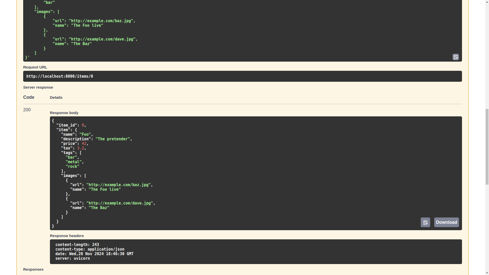
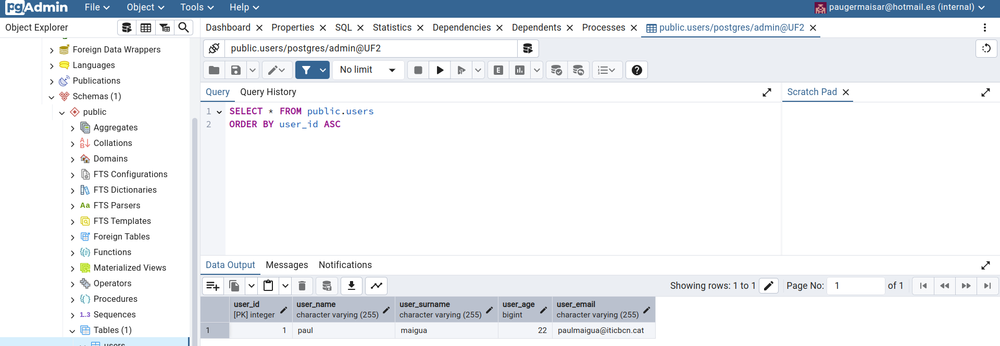
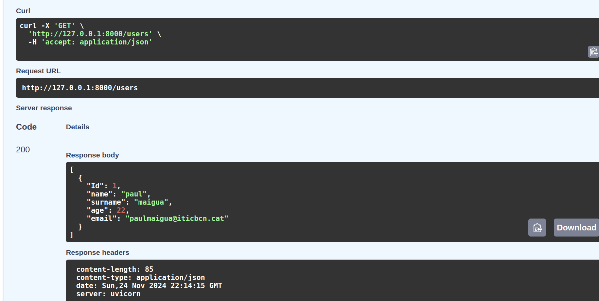
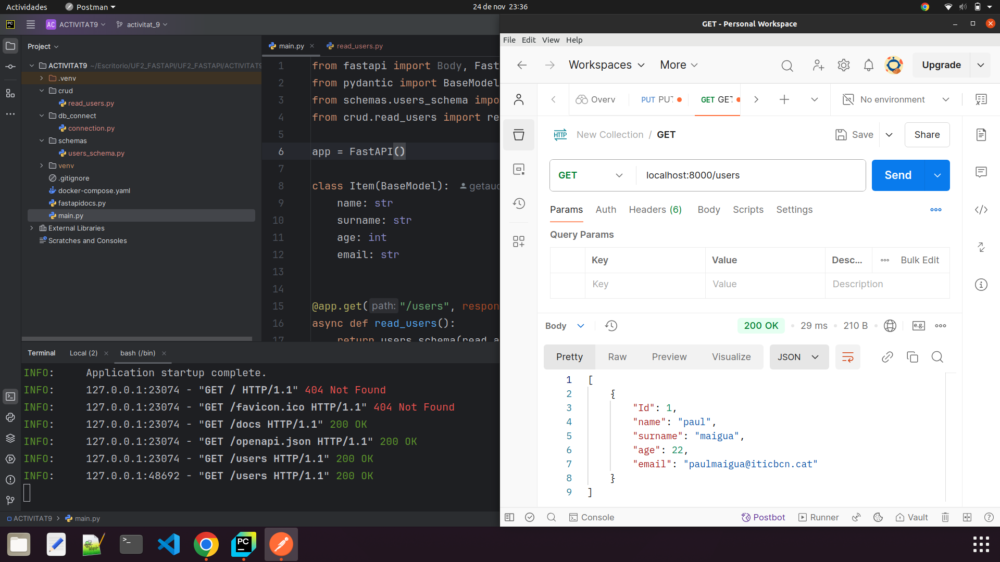

# UF2_FASTAPI

## Body Fields amb FastAPI
FastAPI ens ofereix un tipus d'objecte per afegir validació als atributs del BaseModel.
Si fem servir el codi de la documentació de FastAPI, ens afegira una funció que fa l'operació PUT.
Ens demana un id al path i un objecte amb 4 atributs al body. Fem servir Postman per provar-ho.

## Nested Models amb FastAPI
A més de fer servir tipus primitius com atributs d'un model, podem servir un altre model com a tipus d'un atribut d'un altre model.
És a dir, si declarem un model d'imatge, podem afegir una llista d'objectes Imatge dins del model de Item en l'anterior apartat.
Això ens demanarà un body on l'atribut "imatges" del model Item serà un array [] amb objectes Imatge. Cada imatge haurà de tenir els seus atributs dins de "{}".

## Prova de conexió a la BBDD creada a PostgreSQL pgadmin
Fent servir schema, podem validar l'estructura de dades dels users, per no tenir problemes al procesar-lo amb el model en fastapi.

## Prova amb Postman
El mateix codi d'abans, però modificant l'estructura del proyecte i organitzant els arxius en directoris segons la seva funció.
Podem veure que amb Python 3.10 fácilment podem refactoritzar els imports amb `from nom_directori.nom_arxiu import nom_funció`.

