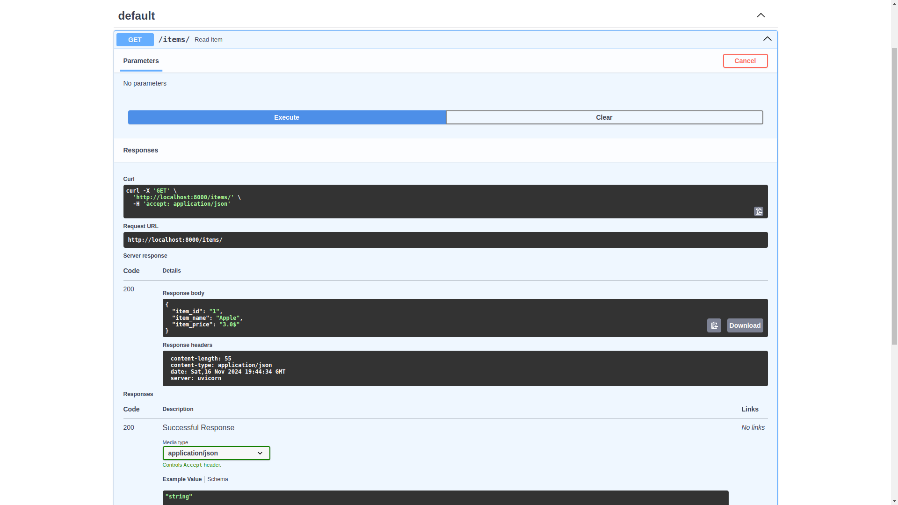

# UF2_FASTAPI

## Body Fields amb FastAPI
FastAPI ens ofereix un tipus d'objecte per afegir validació als atributs del BaseModel.
Si fem servir el codi de la documentació de FastAPI, ens afegira una funció que fa l'operació PUT.
Ens demana un id al path i un objecte amb 4 atributs al body. Fem servir Postman per provar-ho.

