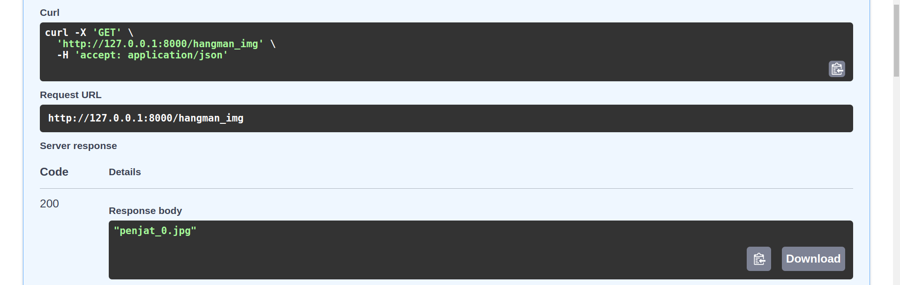

# UF2_FASTAPI

## Disseny DB


Justificació: La primera idea per a la BBDD era fer les quatre taules demanades a l'enunciat: usuaris, paraules, registre de joc i informació per pantalla.

Per controlar els futurs usuaris que faràn login i gestionar les seves dades del joc, enllaçarem les taules usuaris i registre de joc amb una foreign key usuari_id.
La taula hangman servirà per emmagatzemar la llista de paths d'imatges del penjat (penjat_0.jpg, etc.) en una sola columna.
Info_pantalla només tindrà una row i múltiples columes pels textos a renderitzar al frontend.

## Endpoints Swagger (/docs)
L'endpoint de /usuari fa servir un schema per renderitzar (donar format) a les dades del jugador en un list[dict].
```
def usuari_schema(usuari) -> dict:
    return {
        "Punts partides actuals": usuari[0],
        "Total partides": usuari[1],
        "Partides guanyades": usuari[2],
        "Partida amb més punts": usuari[3],
    }

def usuaris_schema(usuaris) -> list[dict]:
    return [usuari_schema(usuari) for usuari in usuaris]
```

### GET /boto_inici


### GET /paraula_secreta


### GET /hangman_img


### GET /abecedari


### GET /usuari

