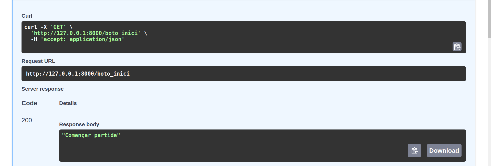

# UF2_FASTAPI

## Inserció de dades d'un CSV a una base de dades postgresql
Amb la llibreria "pandas" llegim els continguts de l'arxiu .csv amb les paraules per temàtica del penjat.


El mètode read_csv ens retorna un dataframe (Serie de Series). Per poder enviar-ho a la base de dades
l'hem de convertir en un diccionari. Anirem iterant cada fila de les columnes WORD i THEME, fent tants inserts com paraules hi hagin.



Cal fixar-nos que on diu `data["WORD"][pos]` no estem iterant un array de dues dimensions, sinó que iterem
un diccionari de dues columnes on cada columna té un sol array unidimensional. Llavors, la crida amb el primer
valor `["WORD"]` fa referència a la columna word `{ WORD: ['Software', ...] }`, i `[pos]` la posició a l'array 1D amb les paraules.


## Llistar els themes i una paraula aleatoria segons el theme amb endpoints de FastAPI
Un cop tenim les WORDS i THEMES a la database podem configurar els endpoints.
El primer endpoint ("/penjat/tematica/opcions") trucarà a una funció que realitza la consulta sql per rebre els THEMES.


Distinct agafarà els valors únics de THEMES per no repetir.
Un cop tenim els themes, farem un schema per renderitzar(donar un format) a aquests valors seguint l'estructura:
```
[
  {
    "option": "nomtematica1"
  },
  {
    "option": "nomtematica2"
  },
  {
    "option": "nomtematica3"
  },
  {
    "option": "nomtematica4"
  },
  {
    "option": "nomtematica5"
  }
]
```


Es tracta d'un array de diccionaris amb un sol key-value per diccionari.
<br />
Farem quasi el mateix amb l'altre endpoint ("penjat/tematica{option}"). Aquest rebrà un paràmetre option, que serà el nom del theme,
i l'utilitzarem a la consulta sql amb `WHERE = %s;` per rebre les paraules que pertanyen a aquest theme.
Es podria fer un SELECT que retornés una paraula i l'agafariem amb fetchone() en lloc de fetchall(). Aquesta seria una altra
opció viable, però aqui he optat per deixar al propi script python fer la selecció de la paraula aleatoria amb randint(0,99) a l'array
que ens retorna fetchall().
